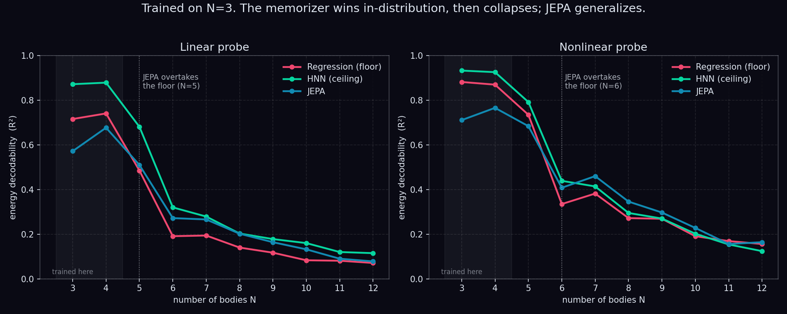

# ThreeBody-JEPA

Benchmarking Joint-Embedding Predictive Architectures on chaotic three-body dynamics.

A controlled test of whether a JEPA-style latent-prediction objective recovers the structure of
gravitational n-body dynamics (the conservation laws and the pairwise interaction) more than a
memorizing baseline does, benchmarked against a Hamiltonian model that is handed the structure by
construction.

The three-body problem is the testbed because it is chaotic. The exact trajectory is unpredictable,
so a model that merely curve-fits drifts off the conservation surface during rollout, while a model
that internalized the physics stays on the constraint manifold even as its specific trajectory
diverges. We train at N=3 and measure how conservation and latent-decodability behave as bodies are
added (N=4 through 12).

## The ladder

One encoder class, one trainer, three swappable objectives. Any measured gap is attributable to the
objective, not the architecture.

| Tier | What it is given | Role |
|------|------------------|------|
| Integrator (REBOUND, IAS15) | the equations | reference line and data generator |
| HNN | Hamiltonian structure | ceiling |
| JEPA | nothing, latent prediction | the question |
| Regression | nothing, direct state prediction | floor |

The finding lives in the gap: how far up the conservation and scaling axes a learner given no
physics climbs on its own, and whether the N-scaling curve holds its shape.

## Method

**Data.** REBOUND with the IAS15 integrator generates 3D trajectories. We call `move_to_com()`
before integrating so center-of-mass drift does not pollute the momentum metric, record
`[x, y, z, vx, vy, vz]` plus `energy()` and `angular_momentum()` each step, and reject trajectories
that fly apart. Positions and velocities are normalized to unit scale.

**Encoder.** A hand-rolled permutation-equivariant graph net. All-pairs message passing on relative
positions (gravity depends on separation, so relative positions give translation invariance for
free), sum aggregation, node update, L layers. The same encoder class backs all three objectives.

**Objectives.**
- Regression: encoder, then a decoder MLP predicting the next normalized state. MSE. The floor.
- HNN: encoder, mean-pool, a scalar Hamiltonian H, then `dx/dt = M grad(H)` via autograd, supervised
  on the finite-difference derivative. Rollout uses symplectic (semi-implicit) Euler so the learned
  field conserves energy. The ceiling.
- JEPA: a body-masked predictor. The context encoder sees a subset of bodies, the predictor predicts
  the masked bodies' future latent conditioned on their state and the time offset. EMA target
  encoder, stop-gradient, LayerNorm on the target, L1 loss. This is the I-JEPA / V-JEPA masking
  mechanism, with the body as the spatial axis and time as the prediction axis.

**Rollout predictor.** JEPA outputs a latent, not a state. For a full-system state rollout we add a
separate latent dynamics model trained on the frozen encoder, V-JEPA-2-AC style: a teacher-forced
one-step loss plus a two-step rollout loss where the prediction is fed back in latent space, with
the predictor output normalized before the loss. A post-hoc decoder maps the latent back to state
for display.

**Metrics.** Conservation drift (relative std of energy over a multi-seed state-space rollout),
linear and nonlinear energy-decodability probes on the frozen pooled latent (the Alain and Bengio
method, and its caveat that linearly decodable is not the same as used), and the N-scaling sweep.
Never long-horizon trajectory error, which chaos forbids.

## Experiments

The interesting part of this project is what did not work as much as what did.

**Masking is the mechanism.** The first JEPA predicted the whole future latent from the whole present
latent. That is the single-block, no-mask regime, and I-JEPA's own ablations show it gives weak
representations. Switching to body-masking (hide a body, predict its future from the visible ones)
is what forces the encoder to learn the interaction. It lifted the nonlinear energy probe from 0.43
to 0.67.

**The rollout collapses, and V-JEPA-2 says how to fix it.** A naive autoregressive all-bodies rollout
collapses: every body converges to the center of mass within a few steps. This is exactly the
"temporally collapsed predictions" failure V-JEPA-2 reports. Input noise (the GNS state-space fix)
did not help. The fix that did is V-JEPA-2-AC's recipe: a separate latent rollout predictor trained
with a teacher-forcing term plus a two-step rollout loss, fed back in latent space. With it the
system stays alive and tracks the ground-truth radius over the full rollout.

**V-JEPA 2.1 does not transfer at this scale.** We implemented the dense predictive loss and deep
self-supervision faithfully, verified against the released code (channel-concatenated per-level
LayerNorm'd targets, an MLP-fused multi-level context, a single L*D projection, L1, a lambda warmup).
Ablated against the base masked JEPA, it hurt every metric, including a negative linear probe at N=3.
These are billion-parameter video techniques, and at our scale they over-constrain a model that has
nothing extra to grab onto.

**Scaling does not buy extrapolation here.** We swept model size from 1M to 40M parameters.
In-distribution fit at N=3 climbs with size, but extrapolation to N=5 peaks at a small model
(192-dim, 3.5M) and degrades with further scale. The largest model collapses. We then scaled the
data (600, 3000, 8000 trajectories) and re-ran the bigger models with the full SOTA recipe. More
data helps the small model modestly, the big models never catch up, and the SOTA recipe still
collapses them. Strong weight decay (the 0.04 to 0.4 schedule from the paper) over-regularizes a
model this small into collapse. Training a single model on all of N=3 to 6 is worse than the N=3
specialist, in distribution and out.

The consistent conclusion: this is a low-complexity problem (a handful of invariants and a pairwise
law), so a small lightly-regularized model already reaches the representational ceiling, and the
scale-era SSL machinery does not transfer. The final model is the small one.

## Results

Final model: 192-dim encoder, 4 message-passing layers, 8-layer predictor, trained on 3000 N=3
trajectories with the light recipe.

Conservation drift over a multi-seed rollout, relative std of energy:

| N | HNN (ceiling) | Regression (floor) |
|---|---------------|--------------------|
| 3 | 3.8 | 2.5e2 |
| 4 | 1.9 | 1.5e6 |
| 5 | 0.8 | 3.8e5 |

The HNN holds energy to order 1 while the floor explodes by six orders of magnitude as N grows.
That is the chaos discriminator working as intended.

**Extrapolation: the crossover.** The headline result is not that JEPA beats the baselines outright,
it does not. Trained only on N=3, we probe how well system energy decodes from each frozen latent as
bodies are added, N=3 to 12. In distribution the ordering is HNN > Regression > JEPA: the regression
baseline is trained to reproduce the full next state, so energy reads almost straight out of its
latent, while JEPA keeps only what it needs to predict masked bodies and sits below it. But the
memorizer is brittle. As N grows it falls off a cliff, while JEPA degrades gracefully and overtakes
it, at N=5 on the linear probe and N=6 on the nonlinear probe, and holds the lead out to N=12 (where
every model approaches the noise floor). The model handed no physics did not win by memorizing
better. It won by not memorizing.



On the nonlinear probe JEPA also edges past the HNN from N=7 on: a single global Hamiltonian scales
worse with body count than JEPA's per-body latent. We do not lean on this (absolute R² is low that
far out), but it is a real effect.

The latent rollout does not collapse, and in the hidden-body task JEPA infers a missing planet's
trajectory from the visible bodies and tracks it across N=3 to 6.

## Layout

```
config.py            dataclasses (DataCfg, ModelCfg, TrainCfg)
data.py              REBOUND generation and NBodyDataset
models/encoder.py    permutation-equivariant graph net (shared backbone)
models/predictor.py  body-masked predictor (V-JEPA 2.1 deep supervision optional)
models/jepa.py       EMA target, stop-grad, masked loss
models/baselines.py  regression and HNN heads
models/decoder.py    post-hoc latent to state
models/rollout_predictor.py  latent dynamics model (V-JEPA-2 rollout loss)
train.py             trainer with objective dispatch, lr and EMA schedules
train_rollout.py     trains the latent rollout predictor on the frozen encoder
eval.py              probes, conservation drift, rollout primitives
scaling.py           the N=3,4,5 sweep and conservation figure
extend_n.py          extrapolation probe sweep, N=3 to 12
plot_crossover.py    the crossover headline figure (assets/)
seed_preview.py, export_seeds.py   hidden-body seed selection for the videos
viz.py, viz_hidden.py, manim_*.py   visualizations
```

## Run

```bash
uv sync
uv run python train.py --objective regression
uv run python train.py --objective hnn
uv run python train.py --objective jepa
uv run python train_rollout.py
uv run python scaling.py
uv run python extend_n.py        # extrapolation sweep N=3..12
uv run python plot_crossover.py  # the crossover figure
```

## References

I-JEPA (Assran et al. 2023), V-JEPA (Bardes et al. 2024), V-JEPA 2 (2025), V-JEPA 2.1 (2026),
Hamiltonian Neural Networks (Greydanus et al. 2019), Learning to Simulate Complex Physics with Graph
Networks (Sanchez-Gonzalez et al. 2020), Newton vs the machine (Breen et al. 2020), REBOUND.
